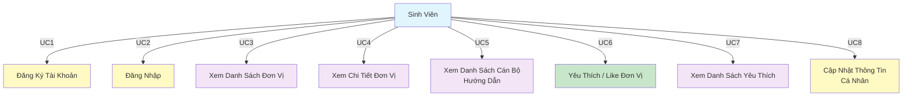
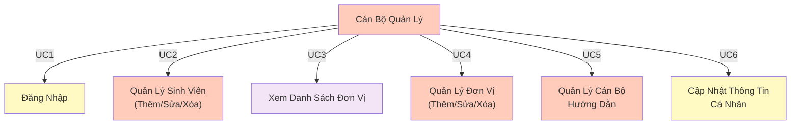
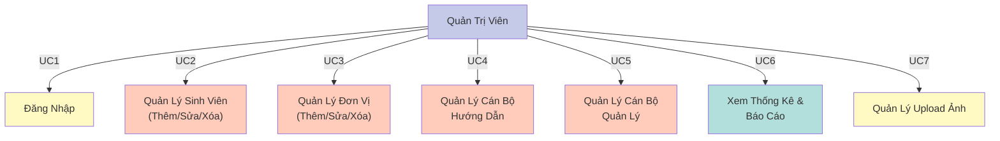
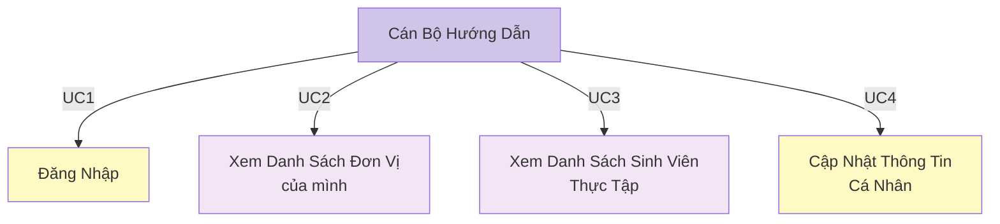
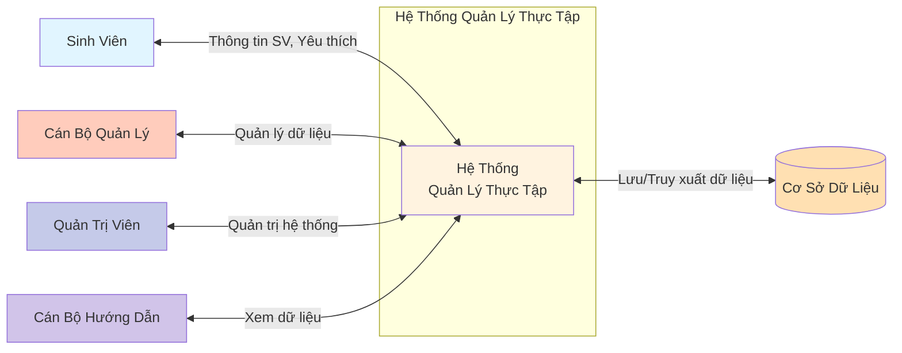
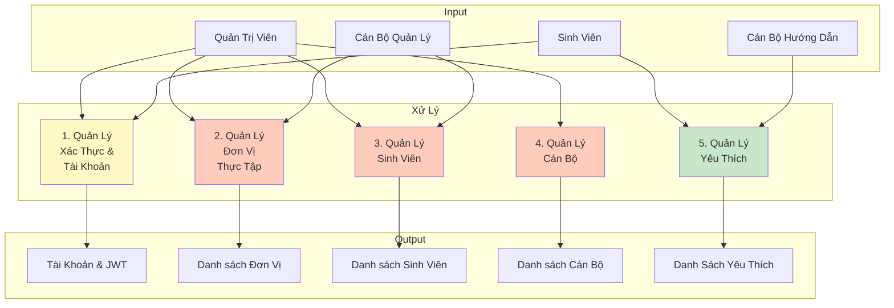
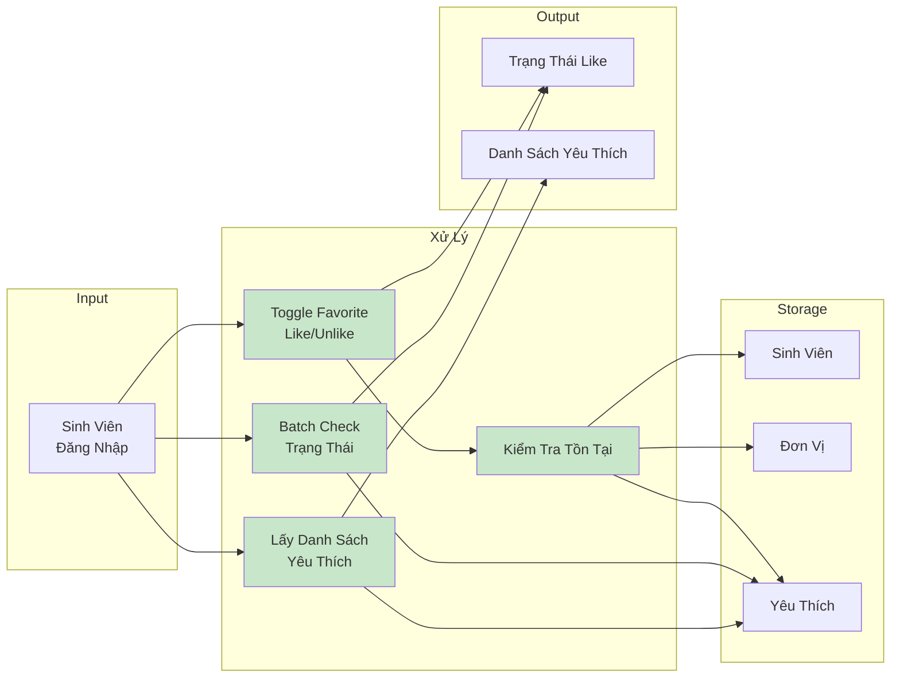
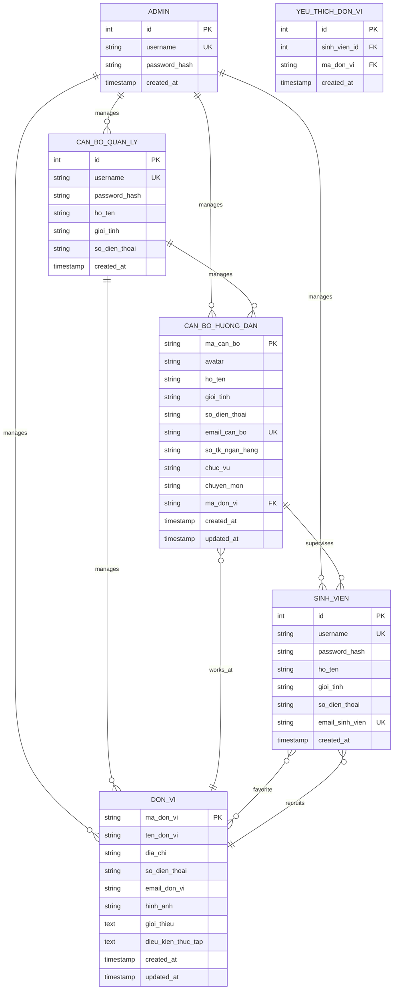

# Sơ Đồ Hệ Thống Quản Lý Thực Tập

## 1. BIỂU ĐỒ USE CASE

### 1.1 Use Case - Sinh Viên (Student)


### 1.2 Use Case - Cán Bộ Quản Lý (Management Staff)


### 1.3 Use Case - Quản Trị Viên (Administrator)


### 1.4 Use Case - Cán Bộ Hướng Dẫn (Supervisor)


---

## 2. BIỂU ĐỒ LUỒNG DỮ LIỆU (DFD)

### DFD Level 0 - Ngữ Cảnh Hệ Thống


### DFD Level 1 - Các Quá Trình Chính


### DFD Chi Tiết - Quá Trình Yêu Thích Đơn Vị


---

## 3. BIỂU ĐỒ THỰC THỂ - QUAN HỆ (ERD)

### Toàn Bộ Schema


### Chi Tiết Schema
```
┌──────────────────────────────────────────────────────────────────┐
│                      ADMIN (Quản Trị Viên)                        │
├──────────────────────────────────────────────────────────────────┤
│ id (PK)              │ INT AUTO_INCREMENT                         │
│ username (UNIQUE)    │ VARCHAR(100)                               │
│ password_hash        │ VARCHAR(255) [bcrypt hashed]              │
│ created_at           │ TIMESTAMP                                  │
└──────────────────────────────────────────────────────────────────┘

┌──────────────────────────────────────────────────────────────────┐
│               SINH_VIEN (Sinh Viên)                              │
├──────────────────────────────────────────────────────────────────┤
│ id (PK)              │ INT AUTO_INCREMENT                         │
│ username (UNIQUE)    │ VARCHAR(100)                               │
│ password_hash        │ VARCHAR(255) [bcrypt hashed]              │
│ ho_ten               │ VARCHAR(255)                               │
│ gioi_tinh            │ ENUM('Nam','Nữ','Khác')                   │
│ so_dien_thoai        │ VARCHAR(50)                                │
│ email_sinh_vien (UK) │ VARCHAR(100) [UNIQUE]                      │
│ created_at           │ TIMESTAMP                                  │
└──────────────────────────────────────────────────────────────────┘
            ▲
            │ 1:N
            │
            └─────────────────────────────────┐
                                              │
┌──────────────────────────────────────────────────────────────────┐
│             YEU_THICH_DON_VI (Junction Table)                    │
├──────────────────────────────────────────────────────────────────┤
│ id (PK)              │ INT AUTO_INCREMENT                         │
│ sinh_vien_id (FK)    │ INT → SINH_VIEN.id [ON DELETE CASCADE]   │
│ ma_don_vi (FK)       │ VARCHAR(10) → DON_VI.ma_don_vi            │
│ created_at           │ TIMESTAMP                                  │
│ UNIQUE(sinh_vien_id, │ Prevent duplicates                         │
│        ma_don_vi)    │                                            │
└──────────────────────────────────────────────────────────────────┘
            △                           △
            │ N:N                      │ N:M
            │                          │
            └──────────────────────────┘

┌──────────────────────────────────────────────────────────────────┐
│                 DON_VI (Đơn Vị Thực Tập)                         │
├──────────────────────────────────────────────────────────────────┤
│ ma_don_vi (PK)       │ VARCHAR(10)                                │
│ ten_don_vi           │ VARCHAR(255)                               │
│ dia_chi              │ VARCHAR(255)                               │
│ so_dien_thoai        │ VARCHAR(50)                                │
│ email_don_vi         │ VARCHAR(100)                               │
│ hinh_anh             │ VARCHAR(255)                               │
│ gioi_thieu           │ TEXT                                       │
│ dieu_kien_thuc_tap   │ TEXT                                       │
│ created_at           │ TIMESTAMP                                  │
│ updated_at           │ TIMESTAMP (auto-update)                    │
└──────────────────────────────────────────────────────────────────┘

┌──────────────────────────────────────────────────────────────────┐
│          CAN_BO_QUAN_LY (Cán Bộ Quản Lý)                        │
├──────────────────────────────────────────────────────────────────┤
│ id (PK)              │ INT AUTO_INCREMENT                         │
│ username (UNIQUE)    │ VARCHAR(100)                               │
│ password_hash        │ VARCHAR(255) [bcrypt hashed]              │
│ ho_ten               │ VARCHAR(255)                               │
│ gioi_tinh            │ ENUM('Nam','Nữ','Khác')                   │
│ so_dien_thoai        │ VARCHAR(50)                                │
│ created_at           │ TIMESTAMP                                  │
└──────────────────────────────────────────────────────────────────┘

┌──────────────────────────────────────────────────────────────────┐
│        CAN_BO_HUONG_DAN (Cán Bộ Hướng Dẫn)                      │
├──────────────────────────────────────────────────────────────────┤
│ ma_can_bo (PK)       │ VARCHAR(10)                                │
│ avatar               │ LONGTEXT                                   │
│ ho_ten               │ VARCHAR(255)                               │
│ gioi_tinh            │ ENUM('Nam','Nữ','Khác')                   │
│ so_dien_thoai        │ VARCHAR(50)                                │
│ email_can_bo (UK)    │ VARCHAR(100) [UNIQUE]                      │
│ so_tk_ngan_hang      │ VARCHAR(50)                                │
│ chuc_vu              │ VARCHAR(100)                               │
│ chuyen_mon           │ VARCHAR(255)                               │
│ ma_don_vi (FK)       │ VARCHAR(10) → DON_VI.ma_don_vi            │
│                      │ [ON DELETE SET NULL]                       │
│ created_at           │ TIMESTAMP                                  │
│ updated_at           │ TIMESTAMP (auto-update)                    │
└──────────────────────────────────────────────────────────────────┘
```

---

## 4. BẢNG TÓM TẮT CHỨC NĂNG VỚI QUYỀN HẠN

| Use Case | Admin | Cán Bộ QL | Cán Bộ HD | Sinh Viên | API Endpoint |
|----------|:-----:|:---------:|:---------:|:---------:|--------------|
| **Xác Thực** |
| Đăng Nhập | ✓ | ✓ | ✓ | ✓ | POST /api/xac_thuc/login |
| Đăng Ký | - | - | - | ✓ | POST /api/xac_thuc/register |
| Lấy Thông Tin User | ✓ | ✓ | ✓ | ✓ | GET /api/xac_thuc/me |
| **Quản Lý Sinh Viên** |
| Xem Danh Sách | ✓ | - | - | - | GET /api/sinh_vien |
| Xem Chi Tiết | ✓ | - | - | ✓ | GET /api/sinh_vien/:id |
| Thêm | ✓ | - | - | - | POST /api/sinh_vien |
| Sửa | ✓ | - | - | ✓* | PUT /api/sinh_vien/:id |
| Xóa | ✓ | - | - | - | DELETE /api/sinh_vien/:id |
| **Quản Lý Đơn Vị** |
| Xem Danh Sách | ✓ | ✓ | ✓ | ✓ | GET /api/don_vi |
| Xem Chi Tiết | ✓ | ✓ | ✓ | ✓ | GET /api/don_vi/:maDonVi |
| Tìm Kiếm | - | ✓ | ✓ | ✓ | GET /api/don_vi/search |
| Thêm | ✓ | ✓ | - | - | POST /api/don_vi |
| Sửa | ✓ | ✓ | - | - | PUT /api/don_vi/:maDonVi |
| Xóa | ✓ | ✓ | - | - | DELETE /api/don_vi/:maDonVi |
| Upload Ảnh | ✓ | ✓ | - | - | POST /api/don_vi/upload |
| **Quản Lý Cán Bộ Quản Lý** |
| Xem Danh Sách | ✓ | - | - | - | GET /api/can_bo_quan_ly |
| Xem Chi Tiết | ✓ | - | - | - | GET /api/can_bo_quan_ly/:id |
| Thêm | ✓ | - | - | - | POST /api/can_bo_quan_ly |
| Sửa | ✓ | ✓* | - | - | PUT /api/can_bo_quan_ly/:id |
| Xóa | ✓ | - | - | - | DELETE /api/can_bo_quan_ly/:id |
| **Quản Lý Cán Bộ Hướng Dẫn** |
| Xem Danh Sách | ✓ | ✓ | - | ✓ | GET /api/can_bo_huong_dan |
| Xem Chi Tiết | ✓ | ✓ | - | ✓ | GET /api/can_bo_huong_dan/:maCanBo |
| Tìm Kiếm | - | ✓ | - | ✓ | GET /api/can_bo_huong_dan/search |
| Thêm | ✓ | ✓ | - | - | POST /api/can_bo_huong_dan |
| Sửa | ✓ | ✓ | - | - | PUT /api/can_bo_huong_dan/:maCanBo |
| Xóa | ✓ | ✓ | - | - | DELETE /api/can_bo_huong_dan/:maCanBo |
| **Yêu Thích Đơn Vị** |
| Toggle Like/Unlike | - | - | - | ✓ | POST /api/yeu_thich/toggle |
| Kiểm Tra Trạng Thái | - | - | - | ✓ | GET /api/yeu_thich/check/:maDonVi |
| Xem Danh Sách Yêu Thích | - | - | - | ✓ | GET /api/yeu_thich/danh-sach |
| Batch Check | - | - | - | ✓ | POST /api/yeu_thich/batch-check |
| Lấy Số Lượt Thích | - | - | - | ✓ | GET /api/yeu_thich/count/:maDonVi |
| **Quản Trị Viên** |
| Xem Thống Kê | ✓ | - | - | - | GET /api/quan_tri_vien/thong_ke |

> *✓ = Có quyền | ✓* = Chỉ được chỉnh sửa thông tin của chính mình

---

## 5. LUỒNG AUTHENTICATION & AUTHORIZATION

```
┌─────────────────────────────────────────────────────────────────┐
│                     AUTHENTICATION FLOW                          │
└─────────────────────────────────────────────────────────────────┘

1. LOGIN:
   Client → POST /api/xac_thuc/login (username, password)
   ↓
   Server: Hash mật khẩu & so sánh
   ↓
   Server: Tạo JWT Token {
     - user.id
     - user.role (admin|sinh_vien|can_bo_quan_ly|can_bo_huong_dan)
     - expiresIn: 24h
   }
   ↓
   Client: Lưu token vào localStorage
   
2. REQUEST WITH AUTH:
   Client → GET /api/protected_resource
   Header: Authorization: Bearer <JWT_TOKEN>
   ↓
   Server: Middleware verifyToken() kiểm tra token
   ↓
   Server: Decode token → Lấy user info
   ↓
   Server: Gắn req.user = {id, role, ...}
   ↓
   Middleware checkRole(role1, role2) kiểm tra role
   ↓
   ✓ Pass → Controller xử lý
   ✗ Fail → 403 Forbidden

3. LOGOUT:
   Client: Xóa token khỏi localStorage
   (Server không cần xử lý vì JWT không stateful)
```

---

## 6. CÔNG NGHỆ & STACK

| Thành Phần | Công Nghệ |
|-----------|-----------|
| **Backend** | Node.js + Express.js |
| **Database** | MySQL 8.0+ |
| **Frontend** | React 18 + Hooks |
| **Authentication** | JWT + bcrypt |
| **HTTP Client** | Axios |
| **File Upload** | Multer |
| **State Management** | React Context API |
| **Routing (Frontend)** | React Router v6 |
| **Styling** | CSS3 + Grid/Flexbox |

---

## 7. CHỈ SỐ KEY METRICS

- **Số Đơn Vị**: 42+
- **Số Cán Bộ Hướng Dẫn**: 30+
- **Số Sinh Viên**: Không giới hạn
- **Số Tài Khoản Admin**: 1+
- **Số Cán Bộ Quản Lý**: Không giới hạn
- **Max Favorites per SV**: Không giới hạn
- **JWT Expiry**: 24 giờ
- **Password Hash**: bcryptjs (10 salt rounds)

